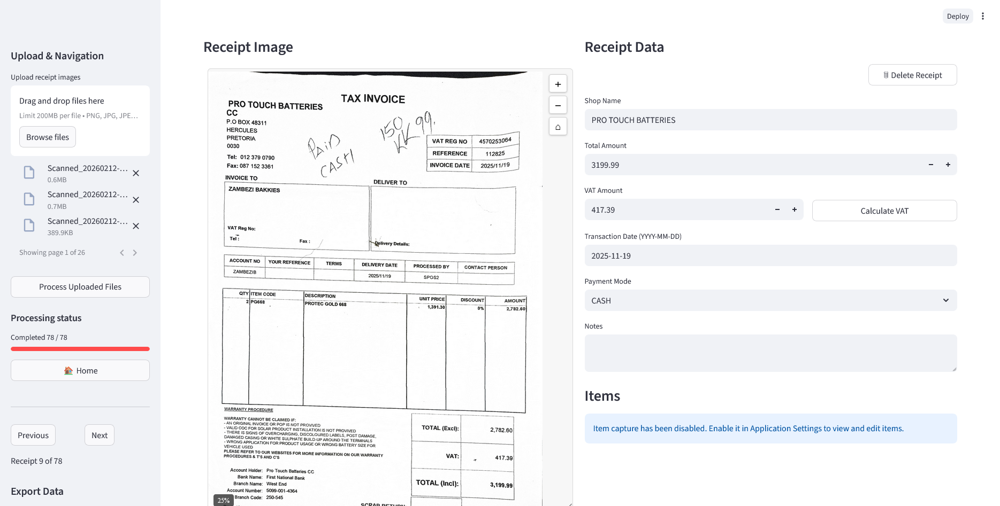

# ScannerAI - Receipt Scanner and Classifier
ScannerAI is a Python application that processes retail receipts using computer vision and AI to extract, classify and analyze receipt data. It features a graphical user interface for viewing and editing receipt information with support for COICOP (Classification of Individual Consumption According to Purchase) code classification.

## Deployment Modes and Branches
ScannerAI ships in two deployment modes that share the same Streamlit UI:

- **Web Hosted Version** – Runs on Streamlit Cloud at [receiptai.streamlit.app](https://receiptai.streamlit.app/). The public app follows the `main` branch.
- **Local Desktop Version** – A Windows executable (`ScannerAI.exe`) that launches Streamlit locally via `launch_scannerai.py`.

This checkout currently uses `main` for hosted production and `dev` for active integration work. The Windows launcher and PyInstaller spec live in the same repo and are released from tagged builds.

## Features

- **Receipt Processing**: Extract text and structured data from receipt images and PDFs
- **Item Classification**: Automatically classify items using COICOP codes
- **Interactive GUI**: View, edit, and manage receipt data
- **Multiple OCR Options**: Support for multiple OCR models including Gemini and OpenAI
- **Batch Processing**: Process multiple receipts from a folder
- **In-App Settings**: Configure OCR providers, API keys, and local paths directly from the UI
- **Export Options**: Download a ZIP containing JSON/CSV data plus renamed original receipt uploads
- **Progress Tracking**: Visual progress tracking for batch operations
- **Processing Controls**: Cancel long-running batches, retry or skip failed receipts, delete receipts from the current session, and exit safely
- **Review Tools**: Edit VAT, payment mode, transaction date, notes, and item rows; calculate VAT from the configured rate

## Hosted Application (Streamlit Cloud)

- Visit [receiptai.streamlit.app](https://receiptai.streamlit.app/) to launch the hosted build immediately.
- You still bring your own API keys (OpenAI, Gemini, Google) and paste them into **Application Settings** just like the desktop version.
- Hosted deployments run with `SCANNERAI_HOSTED_MODE=1`, so settings never touch the server’s filesystem. Each user downloads an encrypted `scannerai_settings.json` and re-imports it later to restore their preferences and API keys.
- Ideal for demos, quick reviews, or teams that don’t want to manage local environments.

## User Interface


## Installation

### Hosted (Web) Workflow

1. Visit [receiptai.streamlit.app](https://receiptai.streamlit.app/).
2. Enter your API keys in **Application Settings** (see [SETTINGS.md](SETTINGS.md)).
3. Follow the same UI workflow described below—no local setup required.

### Local Desktop Workflow (from source)

**1. Clone the repository**
``` bash
git clone https://github.com/rijff24/receiptAI.git
cd receiptAI
```

**2. Set up virtual environment and dependencies**

You are strongly recommended to install resources into a virtual environment.

``` bash
python -m venv scanner-venv
source scanner-venv/bin/activate # PowerShell: .\scanner-venv\Scripts\Activate.ps1
python -m pip install --upgrade pip setuptools wheel
python -m pip install -r requirements.txt
```

> \[!NOTE\] If you intend doing any development work, please install the package as editable and with the `dev` optional dependencies:
>
> ``` bash
> python -m pip install -e ".[dev]"
> ```
>
> Moreover, once you have installed the package, please install the pre-commit hooks. These hooks help us to ensure repository security and a consistent code style.

**3. Configure ScannerAI**

> [!TIP]
> The recommended way to configure ScannerAI is *inside the app*. Launch Streamlit, open the sidebar, and expand **Application Settings**. You can pick the OCR provider, toggle preprocessing, and paste API keys without touching any files. Everything is stored locally and encrypted—see [`SETTINGS.md`](SETTINGS.md) for details.

- Settings are stored under `%APPDATA%\ScannerAI\user_settings.json` on Windows or `~/.config/ScannerAI/user_settings.json` on macOS/Linux.
- Uploaded Google service-account JSON files are saved alongside the settings and never leave your device.
- Hosting centrally? Set `SCANNERAI_HOSTED_MODE=1` and follow the export/import workflow described in [`SETTINGS.md`](SETTINGS.md) so credentials stay on each user’s machine.
- Want the packaged Windows EXE? Download the [local desktop pre-release](#download-the-local-desktop-pre-release) or build it yourself via [`WINDOWS_INSTALL.md`](WINDOWS_INSTALL.md).
- Running from source and want persistent local settings? Set `SCANNERAI_HOSTED_MODE=0` before starting Streamlit. On the `main` branch, the Streamlit script defaults to hosted mode unless this variable is set.

**Headless / legacy configuration**

When running ScannerAI without the UI (CI pipelines, remote servers), you can still supply a `.env`-style file at `src/scannerai/_config/config.txt`:

```bash
DEBUG_MODE=False
ENABLE_PREPROCESSING=False
SAVE_PROCESSED_IMAGE=False
ENABLE_PRICE_COUNT=False
OCR_MODEL=3
CLASSIFIER_MODEL_PATH=/absolute/path/to/your/trained/model
LABEL_ENCODER_PATH=/absolute/path/to/your/label/encoder
GEMINI_API_KEY_PATH=/absolute/path/to/gemini.key
OPENAI_API_KEY_PATH=/absolute/path/to/openai.key
GOOGLE_CREDENTIALS_PATH=/absolute/path/to/google-credentials.json
TESSERACT_CMD_PATH=/absolute/path/to/tesseract.exe
OPENAI_API_KEY=optional-direct-key
GEMINI_API_KEY=optional-direct-key
```

These keys mirror the UI toggles:

- `DEBUG_MODE`, `ENABLE_PREPROCESSING`, `SAVE_PROCESSED_IMAGE`, `ENABLE_PRICE_COUNT`: boolean switches for diagnostics and pricing estimates
- `OCR_MODEL`: `1` = Tesseract + GPT‑3.5, `2` = GPT‑4 Vision, `3` = Gemini Vision
- `CLASSIFIER_MODEL_PATH` / `LABEL_ENCODER_PATH`: optional paths to trained COICOP models
- `GEMINI_API_KEY_PATH`, `OPENAI_API_KEY_PATH`, `GOOGLE_CREDENTIALS_PATH`, `TESSERACT_CMD_PATH`: filesystem fallbacks when you cannot use in-app secrets storage
- `OPENAI_API_KEY`, `GEMINI_API_KEY`: direct environment/config-file fallbacks for non-UI or centrally managed runs

## API Keys

The application requires API keys for OCR services:
- Gemini API key (only if you select the Gemini OCR model)
- OpenAI API key (only if you select the GPT-based OCR models)
- Google Cloud service-account credentials (only for Gemini)

Use the **Application Settings** panel to paste keys directly—ScannerAI encrypts them with `cryptography.Fernet` and stores them locally. For headless deployments, provide file paths or direct API-key environment variables in `config.txt` as shown above. Never commit your keys to Git.

## Trained Model
We put a trained model as an example in src/scannerai/classifiers/trainedModels/, where you can set LRCountVectorizer.sav for CLASSIFIER_MODEL_PATH and encoder.pkl for LABEL_ENCODER_PATH.

The above model is trained based on Logistic Regression (LR) using a popular feature extraction method, Countvectorizer implemented in Scikit-learn Python package.  

## Usage

### Starting the Application

``` bash
$env:SCANNERAI_HOSTED_MODE="0"   # PowerShell; omit this for hosted/stateless mode
streamlit run scripts/lcf_receipt_entry_streamlit.py
```

> Prefer not to run locally? Visit [receiptai.streamlit.app](https://receiptai.streamlit.app/) and use the hosted UI. You will still need to provide your own API keys via the settings sidebar.

#### Basic Workflow

1. Click "Browse files" to select receipt images/PDFs
2. Click "Process Uploaded Files" to process the files
3. Monitor the paged processing status; retry or skip failed receipts if needed
4. Edit shop name, total amount, VAT, payment mode, transaction date, notes, and items
5. Add/delete items or delete the current receipt from the session if needed
6. Navigate between receipts using Previous/Next buttons
7. Download a ZIP containing the selected JSON/CSV export and renamed receipt files

### Process a single receipt
Here is an example using Google's Gemini model to take image or pdf as input and output a dictionary of shop name, items and their prices, total amount and payment methods.

```
import json
import os
from scannerai.ocr.lcf_receipt_process_gemini import LCFReceiptProcessGemini

processor = LCFReceiptProcessGemini()
image_pathfile = os.path.join('/path/to/your/image.jpg')
result = processor.process_receipt(image_pathfile)
print(json.dumps(result, indent=2))

```

## Project Structure

- `scripts/lcf_receipt_entry_streamlit.py`: Main Streamlit UI (uploads, navigation, editing, export)
- `src/scannerai/ocr/`: OCR processors (Gemini Vision, GPT-4 Vision via GPT-4o mini, Tesseract + GPT-3.5)
- `src/scannerai/classifiers/`: COICOP classification utilities and trained models
- `src/scannerai/settings/`: Settings manager with encryption + keyring integration
- `src/scannerai/_config/`: Legacy/headless configuration helpers
- `src/scannerai/utils/`: Shared helpers (PDF merging, token counting, etc.)
- `src/scannerai/settings/settings_manager.py`: Entry point for all settings and secure storage logic
- `launch_scannerai.py`: Windows launcher script used by the packaged build

See [`ARCHITECTURE.md`](ARCHITECTURE.md) for an in-depth developer-oriented walkthrough.

## Download the Local Desktop Pre-release

Want to run ScannerAI without installing Python? Grab the packaged Windows launcher:

- **Release**: [ScannerAI Local Desktop - Alpha Pre-Release (v0.1.0-local-alpha)](https://github.com/rijff24/receiptAI/releases/tag/Alpha0.1.0)
- **Status**: Pre-release (alpha). Expect unsigned SmartScreen prompts and manual updates.
- **Usage**:
  1. Download `ScannerAI.exe` from the release assets.
  2. Place it in a folder of your choice (e.g., `C:\Programs\ScannerAI\`).
  3. Double-click the executable and wait for your browser to open at `http://localhost:8501`.
  4. Configure OCR providers and API keys via **Application Settings** (data is stored under `%APPDATA%\ScannerAI`).

To build the executable yourself or customize the bundle, follow [`WINDOWS_INSTALL.md`](WINDOWS_INSTALL.md).

## Dependencies

See `requirements.txt` for detailed dependencies.

## Configuration

ScannerAI now ships with an in-app settings manager. Launch the Streamlit UI, expand **Application Settings** in the sidebar, and adjust:

- OCR provider (Tesseract + GPT‑3.5, GPT‑4 Vision, Gemini Vision)
- Debug/preprocessing toggles, item capture, default zoom, VAT rate, and pricing estimators
- Local paths for classifier artifacts, Tesseract, and Google credentials
- OpenAI / Gemini API keys (stored encrypted on your machine)

See [`SETTINGS.md`](SETTINGS.md) for screenshots, storage locations, and manual-edit instructions if you need to manage the JSON file programmatically.

### Additional Documentation

- [`ARCHITECTURE.md`](ARCHITECTURE.md) – Deep dive into modules, data flow, and extension points.
- [`CONTRIBUTING.md`](CONTRIBUTING.md) – How to propose changes, coding standards, and contributor recognition.
- [`DEPLOYMENT.md`](DEPLOYMENT.md) – Streamlit Cloud + self-host deployment instructions and common pitfalls.
- [`SECURITY.md`](SECURITY.md) – Responsible disclosure process and hardening tips.
- [`SETTINGS.md`](SETTINGS.md) – UI walkthrough for configuring OCR providers, paths, and API keys.
- [`TROUBLESHOOTING.md`](TROUBLESHOOTING.md) – FAQ for installation, OCR, and hosting issues.
- [`WINDOWS_INSTALL.md`](WINDOWS_INSTALL.md) – Building and distributing the Windows desktop launcher.

## Branch Strategy

- `main`: production branch for the hosted Streamlit deployment and tagged local desktop builds.
- `dev`: integration branch for upcoming hosted and desktop changes before they land on `main`.

### Pre-commit actions

This repository contains pre-commit hooks focused on repository security, including checks for passwords, API keys, large files, and unresolved merge conflict headers. To enable them:

```bash
pip install pre-commit
pre-commit install
```

The hook set can be expanded with Python-specific checks such as `ruff` or `black` when needed.

**NOTE:** Pre-commit hooks execute Python, so it expects a working Python build.


# Security

- API keys pasted in the UI are encrypted with `cryptography.Fernet` and stored only on your machine. They are never synced to GitHub or any remote service.
- Uploaded Google credentials stay inside the local ScannerAI settings directory and inherit restrictive file permissions.
- `.gitignore` excludes autosaves, local configs, and credential files by default—please keep it that way when contributing.
- See `SECURITY.md` for the coordinated disclosure process.

# Development Roadmap

### Near-Term Improvements

- **Receipt categorization:** Automatically tag incoming receipts by department/category.
- **Navigation optimizations:** Preload the previous and next two receipts while you review the current one to make paging instant, and loop "Next" from the last receipt back to the first.
- **Context highlighting:** When you hover a textbox, highlight the region on the receipt image where that value was extracted.
- **Template hints:** Allow users to teach ScannerAI where each field lives for specific companies so parsing becomes deterministic.

### Long-Term Vision

- **Reinforcement learning:** Capture reviewer corrections and feed them into a learning loop so OCR output improves over time.
- **UI/UX refresh:** Modernize the Streamlit interface with clearer states, keyboard shortcuts, and improved accessibility.
- **Security hardening:** Expand threat modeling, secrets management, and audit logging to support enterprise deployments.
- **Data backend:** Connect to a database (cloud or self-hosted) for persistent storage of receipts, metadata, and audit history.
- **Mobile capture:** Upload directly from a smartphone camera into the platform.
- **Accounting integrations:** Bulk-import receipts into major accounting suites, starting with Sage Cloud Accounting, then expanding to other popular systems.

# Credits

This project is a community-maintained fork of the [receipt_scanner](https://github.com/datasciencecampus/receipt_scanner) project originally developed by the [Data Science Campus](https://datasciencecampus.ons.gov.uk/about-us/) at the Office for National Statistics (ONS). The original project applied data science for public good across the UK and internationally.

# License

This community-maintained fork continues to use the original Open Government Licence v3.0:

- Code: © Crown copyright and licensed under the [Open Government Licence v3.0](LICENSE). When redistributing, include the attribution statement:  
  `Contains public sector information licensed under the Open Government Licence v3.0.`
- Documentation: also covered by the [Open Government Licence v3.0](http://www.nationalarchives.gov.uk/doc/open-government-licence/version/3/).

All contributions to this repository are accepted under the same licence terms to ensure downstream users retain the same freedoms.
